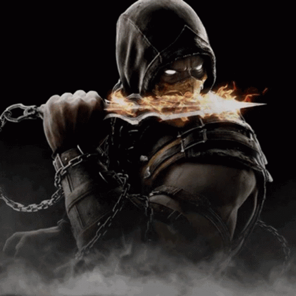
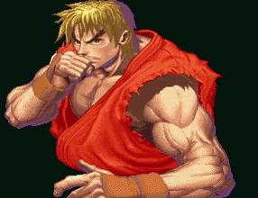
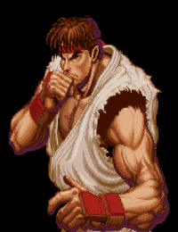

#### Personajes

**Chun-Li**

- **Origen:** Street Fighter
- **Habilidades:** Kikoken, Spinning Bird Kick, Lightning Kick
- **Descripción:** Chun-Li es una experta en artes marciales con una velocidad impresionante y ataques contundentes.

**Scorpion**

- **Origen:** Mortal Kombat
- **Habilidades:** Spear, Teleport Punch, Hellfire
- **Descripción:** Un ninja espectral con habilidades mortales y la capacidad de manipular el fuego infernal.

**Ken**

- **Origen:** Street Fighter
- **Habilidades:** Hadoken, Shoryuken, Tatsumaki Senpukyaku
- **Descripción:** Ken es un luchador feroz conocido por su agresividad y poderosos ataques.

**Ryu**

- **Origen:** Street Fighter
- **Habilidades:** Hadoken, Shoryuken, Tatsumaki Senpukyaku
- **Descripción:** Ryu es un maestro del combate que busca constantemente mejorar su técnica y dominar el arte del Ansatsuken.

#### 🕹️ Jugabilidad
- **Controles:** Utiliza combinaciones de teclas para realizar movimientos especiales y combos.
- **Modos de Juego:** Disfruta de modos de juego variados como el modo arcade, modo versus y modo entrenamiento.
- **Desafíos y Logros:** Completa desafíos y desbloquea logros a medida que progresas en el juego.

#### 💻 Desarrollo
**BattleScript** ha sido desarrollado utilizando JavaScript con Vue.js, para ofrecer una experiencia fluida y emocionante. El juego está inspirado en los clásicos de lucha pero con un toque moderno y accesible para jugadores de todas las edades.

¡Prepárate para la batalla y demuestra quién es el mejor luchador en **BattleScript**! 🥊
